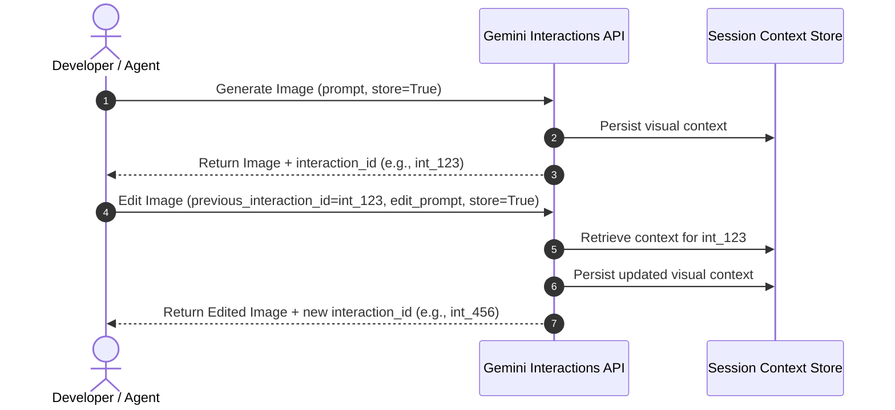

# 🌌 Gemini Interactions API Reference

The **Interactions API** is the next-generation stateful endpoint for Gemini's multi-turn, high-efficiency models. Unlike stateless generations, interactions allow you to store and iteratively refine context—enabling stateful image editing with `gemini-3.1-flash-lite-image`.

---

## 🏗️ Stateful vs. Stateless Architecture

Traditional image generation models are completely stateless: every change requires submitting a brand new text prompt and starting from scratch, resulting in a loss of pixel consistency, character continuity, and structural alignment.

With the **Interactions API**:
1. **The Core Generation**: Generates an initial high-fidelity image and returns a unique `interaction_id` representing that session's state on Google's servers.
2. **Context Persistence**: When editing, you pass the `previous_interaction_id`. The model retrieves the precise context and latent state from your previous turn.
3. **Refinement**: It applies your natural language edit directly onto the existing canvas, maintaining exceptional continuity (e.g., matching the same character, clothing, background structure, lighting, and art style).



---

## 🎨 Gemini 3.1 Flash Lite Image (`gemini-3.1-flash-lite-image`) Cheat Sheet

Gemini 3.1 Flash Lite Image (`gemini-3.1-flash-lite-image`) is a high-efficiency image generation model designed for speed, scale, and high-fidelity editing.

### 🔑 Essential Parameters

| Parameter | Type | Description |
| :--- | :--- | :--- |
| **`model`** | `str` | Must be set to `"gemini-3.1-flash-lite-image"`. |
| **`input`** | `str` \| `list` | Text description or a list containing base64 images and text prompts. |
| **`response_format`** | `dict` | e.g. `{"type": "image"}`. Supports `"aspect_ratio"` (e.g. `"1:1"`, `"16:9"`, `"9:16"`). |
| **`generation_config`**| `dict` | Configuration for `thinking_level`: `'minimal'`, `'low'`, `'medium'`, or `'high'`. |
| **`previous_interaction_id`** | `str` | Performs stateful image editing/refinement on a prior turn's image. |
| **`store`** | `bool` | Set to `True` to allow subsequent stateful edits on the image. |

### 🐍 Python SDK Example

```python
import base64
from google import genai

client = genai.Client()

# 1. Generate an initial image
interaction = client.interactions.create(
    model="gemini-3.1-flash-lite-image",
    input="An astronaut cooking instant ramen in zero gravity, retro anime style",
    response_format={"type": "image", "aspect_ratio": "16:9"},
    generation_config={"thinking_level": "high"},
    store=True
)

# 2. Stateful Edit: Modify the existing image
edited_interaction = client.interactions.create(
    model="gemini-3.1-flash-lite-image",
    previous_interaction_id=interaction.id,
    input="Make the spacesuit neon green and add floating ramen chopsticks",
    response_format={"type": "image"},
    store=True
)

# 3. Local Image Edit (In-line Base64 Upload)
with open("my_sketch.png", "rb") as f:
    b64_data = base64.b64encode(f.read()).decode("utf-8")

local_edit = client.interactions.create(
    model="gemini-3.1-flash-lite-image",
    input=[
        {"type": "image", "data": b64_data, "mime_type": "image/png"},
        {"type": "text", "text": "Turn this rough drawing into a high-fidelity 3D model render"}
    ],
    response_format={"type": "image", "aspect_ratio": "4:3"},
    store=True
)
```

---

## 🛠️ Mapping API Concepts to the MCP Server

The tools in this repository wrap the raw Python SDK calls with robustness features designed for direct tool-use by LLM agents:

### 1. Model Selection
Our server abstracts model naming using the `GEMINI_MODEL_NAME` environment variable (defaulting to `"gemini-3.1-flash-lite-image"`). This allows easy hot-swapping or testing newer model revisions without code changes.

### 2. File Persistence & Security
All response images are received as base64-encoded or raw byte data. The server automatically detects the returned mime-type (PNG, JPEG, WebP) and handles the physical file write to a directory specified by the developer via `IMAGE_OUTPUT_DIR`.

### 3. Concurrency Protection
To prevent file name collisions when multiple agent instances or parallel calls generate images simultaneously, the server appends a high-entropy 8-character hex UUID to every output file:
```
gen_1780123456_a3b2c1d0.png
```

---

## 💡 Best Practices for Stateful Editing

* **Specify `store=True`**: Always set `store=True` in your API calls, or use the MCP tools (which have it enabled by default) if you plan to do multi-turn editing.
* **Keep Edit Prompts Incremental**: Instead of repeating the entire original description in your edit prompt, focus only on the incremental changes (e.g. use `"make the sky dark blue with lightning"` rather than repeating `"a landscape under a dark blue sky with lightning"`).
* **Align Aspect Ratios**: During stateful refinement turns, avoid changing the aspect ratio, as changing ratios between turns can degrade pixel continuity.
* **Optimize Thinking Budgets**:
  * Use `'minimal'` or `'low'` for ultra-fast previews and prototyping.
  * Use `'high'` or `'medium'` when you need complex rendering, text layout accuracy, or advanced character composition.

---

## 🔗 Useful Links
- [Interactions API Reference Guide](https://ai.google.dev/api/interactions-api)
- [Raw Interactions API Details](https://ai.google.dev/api/interactions.md.txt)
