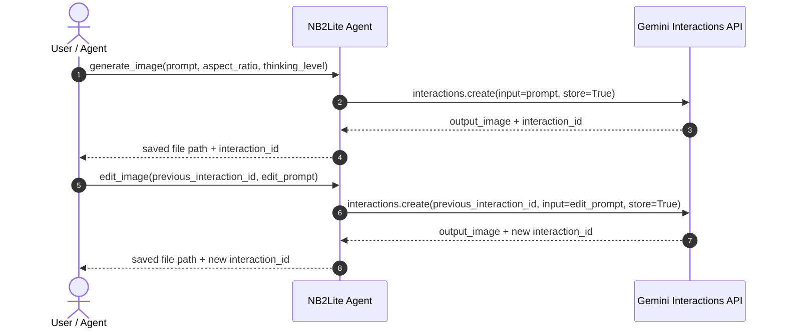

# Gemini Interactions API Notes

This document explains the Gemini Interactions API concepts used by NB2Lite Agent and how they map to the implementation in [server.py](/Users/xbill/nb2lite-codex/server.py).

The server currently targets `gemini-3.1-flash-lite-image` by default, but the model can be changed at runtime with `GEMINI_MODEL_NAME`.

## Project Mapping

NB2Lite Agent wraps the Google GenAI SDK `client.interactions.create(...)` call in four FastMCP tools:

| MCP tool | API pattern | Output prefix |
| --- | --- | --- |
| `generate_image` | Text prompt to image, `store=True` | `gen` |
| `edit_image` | Prompt plus `previous_interaction_id`, `store=True` | `edit` |
| `edit_local_image` | Inline base64 image plus text prompt, `store=True` | `edit_local` |
| `get_help` | Local server help text only | None |

Each generation/edit request asks for an image response and enables `store=True`, so the returned interaction ID can be used for follow-up edits.

## Stateful Editing Model

The Interactions API is used as a stateful workflow:

1. `generate_image` creates the first image and stores the interaction state.
2. The API returns an interaction ID.
3. `edit_image` sends `previous_interaction_id` plus a concise edit prompt.
4. The API returns a new image and a new interaction ID for additional edits.



## Parameters Used by the Server

### Model

`server.py` reads:

```python
MODEL_NAME = os.environ.get("GEMINI_MODEL_NAME", "gemini-3.1-flash-lite-image")
```

That value is passed as the `model` argument on every image generation and edit request.

### Response Format

`generate_image` and `edit_local_image` pass:

```python
response_format = {"type": "image", "aspect_ratio": aspect_ratio}
```

`edit_image` passes:

```python
response_format = {"type": "image"}
```

The server validates aspect ratios before the API call. Supported values are:

- `1:1`
- `16:9`
- `9:16`
- `4:3`
- `3:4`

### Thinking Level

All image tools accept `thinking_level` and pass it through `generation_config`:

```python
generation_config = {"thinking_level": thinking_level.lower()}
```

Supported values are:

- `minimal`
- `low`
- `medium`
- `high`

Use lower values for faster preview iterations and higher values when the prompt needs more complex rendering, composition, or text handling.

### Local Image Input

`edit_local_image` converts a local file to an inline image object:

```python
{"type": "image", "data": data_b64, "mime_type": mime_type}
```

It pairs that object with a text prompt:

```python
[
    {"type": "image", "data": data_b64, "mime_type": mime_type},
    {"type": "text", "text": edit_prompt},
]
```

MIME type is detected with Python's `mimetypes` module, with fallbacks for JPEG, WebP, and PNG.

## SDK Usage Shape

The project uses the Google GenAI SDK:

```python
from google import genai

client = genai.Client(api_key=api_key)
```

Initial generation:

```python
interaction = client.interactions.create(
    model="gemini-3.1-flash-lite-image",
    input="A compact workstation overlooking a rainy neon city",
    response_format={"type": "image", "aspect_ratio": "16:9"},
    generation_config={"thinking_level": "high"},
    store=True,
)
```

Stateful edit:

```python
edited = client.interactions.create(
    model="gemini-3.1-flash-lite-image",
    previous_interaction_id=interaction.id,
    input="Change the city lights to warm amber and add light fog",
    response_format={"type": "image"},
    generation_config={"thinking_level": "medium"},
    store=True,
)
```

Local image edit:

```python
local_edit = client.interactions.create(
    model="gemini-3.1-flash-lite-image",
    input=[
        {"type": "image", "data": image_base64, "mime_type": "image/png"},
        {"type": "text", "text": "Render this sketch as a polished product mockup"},
    ],
    response_format={"type": "image", "aspect_ratio": "4:3"},
    generation_config={"thinking_level": "medium"},
    store=True,
)
```

## File Persistence

The server expects image data in `interaction.output_image`.

When image data is present, `_handle_response`:

1. Infers the extension from `output_image.mime_type`.
2. Builds a filename using prefix, Unix timestamp, and an 8-character UUID suffix.
3. Writes the image under `IMAGE_OUTPUT_DIR` or the current directory.
4. Returns the absolute saved path plus `interaction.id`.

Example output name:

```text
gen_1780123456_a3b2c1d0.png
```

If the API call succeeds but no `output_image` is present, the tool returns the interaction ID and a note that no direct image output was found.

## Error Handling

Tool functions catch exceptions, log the stack trace to stderr, and return a user-facing error string. Input validation happens before SDK calls for:

- Unsupported aspect ratios.
- Unsupported thinking levels.
- Missing local image paths.
- Missing `GEMINI_API_KEY`/`GOOGLE_API_KEY`.

## Best Practices for This Server

- Keep edit prompts incremental. Use `edit_image` for changes like "make the jacket red" or "add a soft reflection on the table" instead of restating the whole original prompt.
- Save the latest interaction ID after every successful generation or edit; each edit returns a new ID.
- Avoid changing aspect ratio during a stateful edit sequence. `edit_image` intentionally does not expose aspect ratio.
- Set `IMAGE_OUTPUT_DIR` when running repeated generations so output files do not clutter the repo root.
- Use `get_help` from the MCP client when checking the server's live configuration.

## Local Verification

Run the unit tests:

```bash
make test
```

The tests mock `client.interactions.create`, so they verify local wrapper behavior without contacting Gemini.
